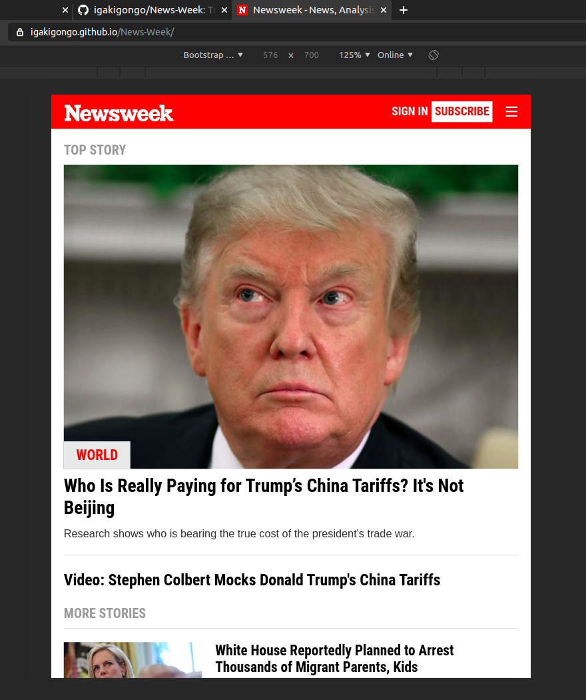

## Introduction
Trying out Twitter’s Bootstrap framework by building a site that actually uses it – Newsweek.

### Specific Tasks
* Think about all the elements on the page and how they are grouped together.
* Add Bootstrap to your project by following the instructions at GetBootstrap.com. Use the examples on that page as templates for how to organize your page.
* Lay out the basic structure of the page using empty semantic HTML elements that are appropriately sized and which are positioned by using the appropriate Bootstrap classes.
* Set up the top title and navigation bar.
* Work your way down the page by filling in and positioning the additional sections.
* Try resizing the browser to see if it mimics the behavior of the real Newsweek homepage.

### Clone and Original Website References

For the demo website please refer to this [link](https://igakigongo.github.io/News-Week/), and for a reference to the live original NewsWeek website please refer to this [link](https://www.newsweek.com/).

### Reference Material
Please visit the section of the Odin Project that talks about this [project](https://www.theodinproject.com/courses/html5-and-css3/lessons/using-bootstrap) to read more upon what should be done.

### Screenshots

#### Bootstrap XS - Media Screen

#### Bootstrap SM - Media Screen

#### Bootstrap MD - Media Screen

#### Bootstrap LG - Media Screen

### Contributors

- [Edward Iga Kigongo](github.com/igakigongo)